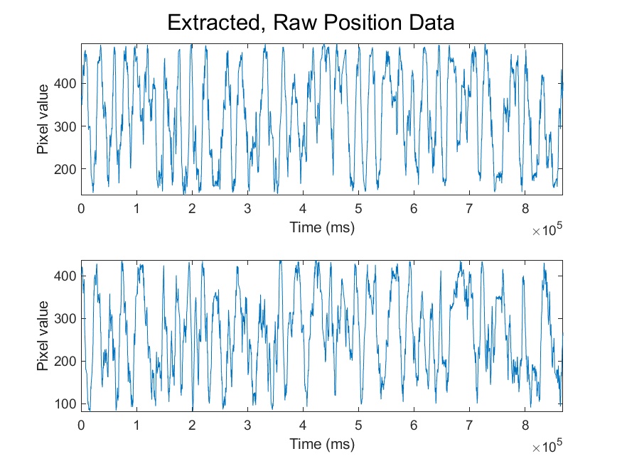
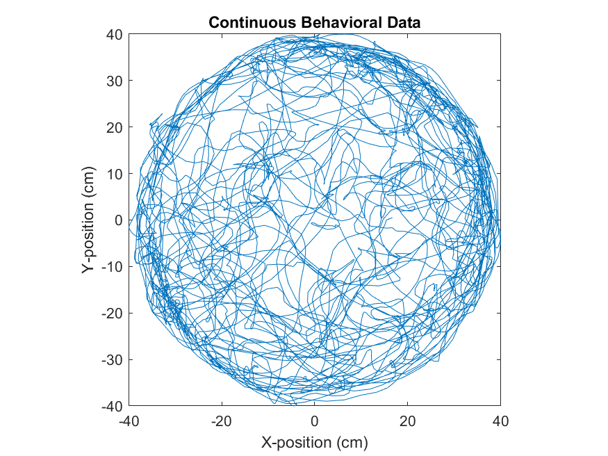
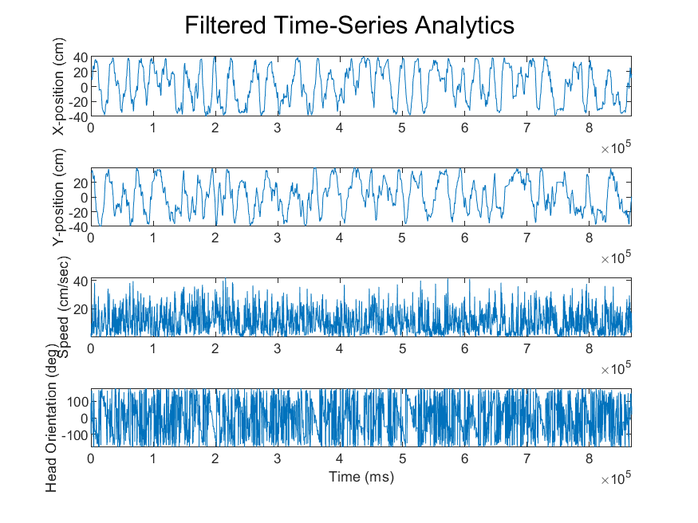
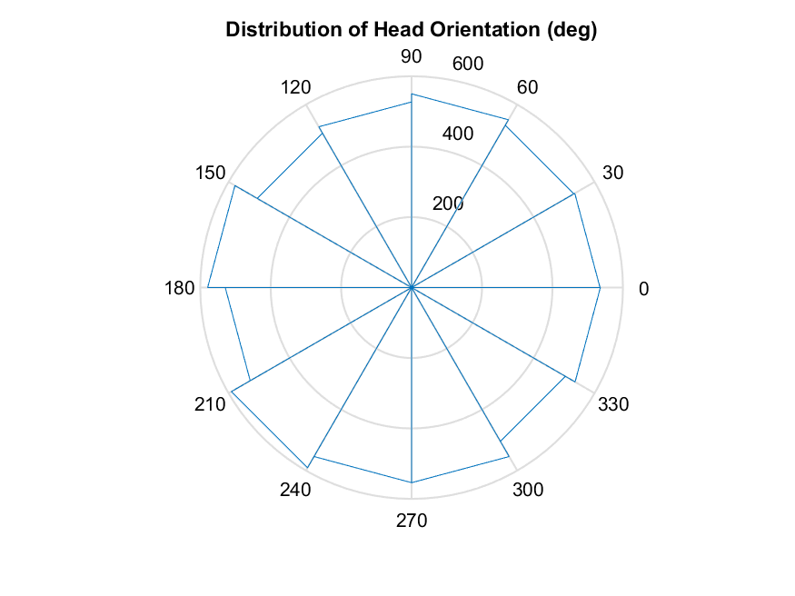
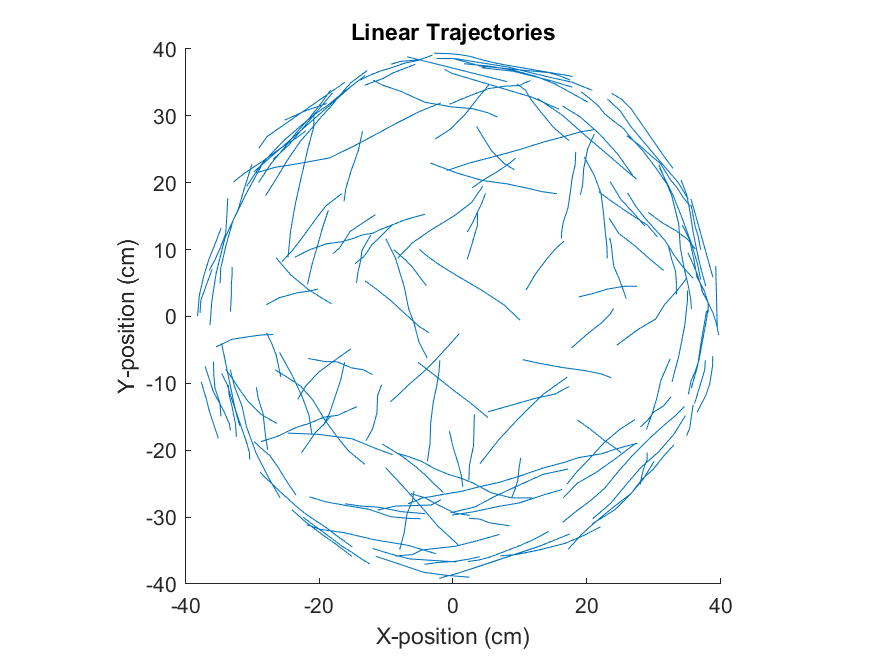
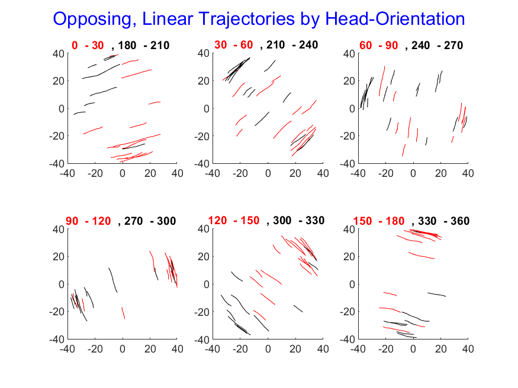
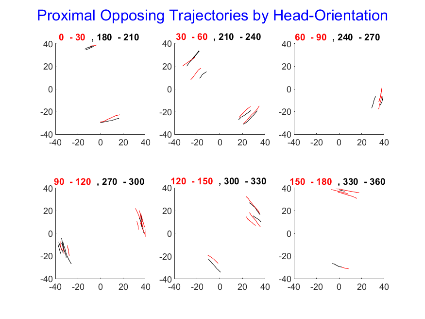
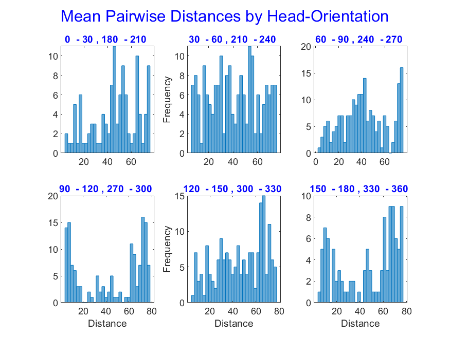
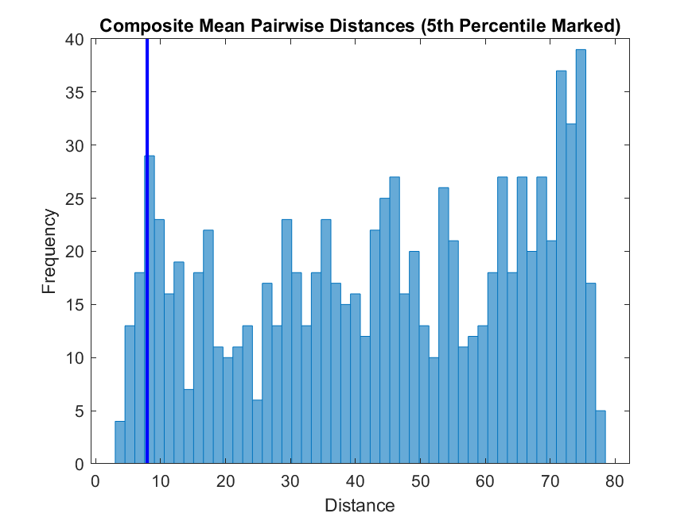

# 🚦 Trajectory Intelligence Dashboard

**From raw video pixels to predictive insights — showcasing a nine‑stage analytic pipeline built for real‑world telematics, robotics, and spatial analytics.**

---

## 🧭 Why Trajectory Matters

Modern telemetry systems capture *where* and *how* an entity moves. But turning those XY time‑series into decisions — **collision avoidance**, **route optimisation**, **behavioural detection** — requires a multi‑layer pipeline.  
This dashboard walks through nine figures, each a transformation step that widens the lens from noisy coordinates to machine‑learning‑ready features.

---

## 🌍 Cross‑Industry Impact

- **Autonomous Vehicles:** Real‑time trajectory overlap avoids path collisions and minimises idle taxiing  
- **Smart Warehousing:** Forklift telematics leverage percentile thresholds to trigger geo‑fenced slow‑downs  
- **Sports Performance:** Coaches quantify athlete coverage and fatigue by mapping high‑speed strokes  
- **Public Safety & CCTV:** Loitering detection uses directional histograms to flag suspicious circling  
- **Aerial Robotics:** Flight‑path redundancy informs battery allocation and rerouting

---

## 📦 Dashboard Cards

### 1. Frame‑Level Position Extraction
  
Pixel‑accurate XY traces gathered at millisecond resolution. In autonomous vehicles and sports motion capture, this is the *ground‑truth* feed for higher‑order analytics.

---

### 2. Drift‑Free Trajectory Reconstruction
  
Smoothing and centring remove lens distortion and arena bias — the same principles that underpin SLAM correction in warehouse robots and drone navigation.

---

### 3. Multi‑Modal Time‑Series Context
  
Velocity, speed and heading are fused into a stitched signal. In predictive maintenance, such composite traces anticipate anomalous wear before it escalates.

---

### 4. Directional Intent Polar Histogram
  
Rose plots bin heading into 30° wedges. Crowd‑flow controllers and CCTV triage engines use identical binning to forecast movement funnels in real time.

---

### 5. Velocity‑Gated Linear Strokes
  
Only high‑speed linear strokes survive this gate, isolating purposeful bursts from idle drift — mirroring how logistics firms flag forklifts exceeding safety thresholds.

---

### 6. Opposing Linear Paths by Orientation
  
Bidirectional segments reveal potential conflict corridors. Multi‑agent simulators plug these vectors into reinforcement learning for cooperative policy training.

---

### 7. Proximal Conflict Candidates
  
The 5th‑percentile distance filter spotlights near‑misses. Insurance telematics and UAV traffic managers use the same threshold logic to price risk in real time.

---

### 8. Overlap Histogram by Direction
  
Pairwise distances between opposing paths quantify redundancy within narrow angles — crucial for optimising drone patrol loops and warehouse pick routes.

---

### 9. Global Overlap Distribution
  
The global 5th‑percentile cut‑off acts as a dynamic anomaly threshold. Telemetry dashboards surface paths below this line as potential process deviations.

---

