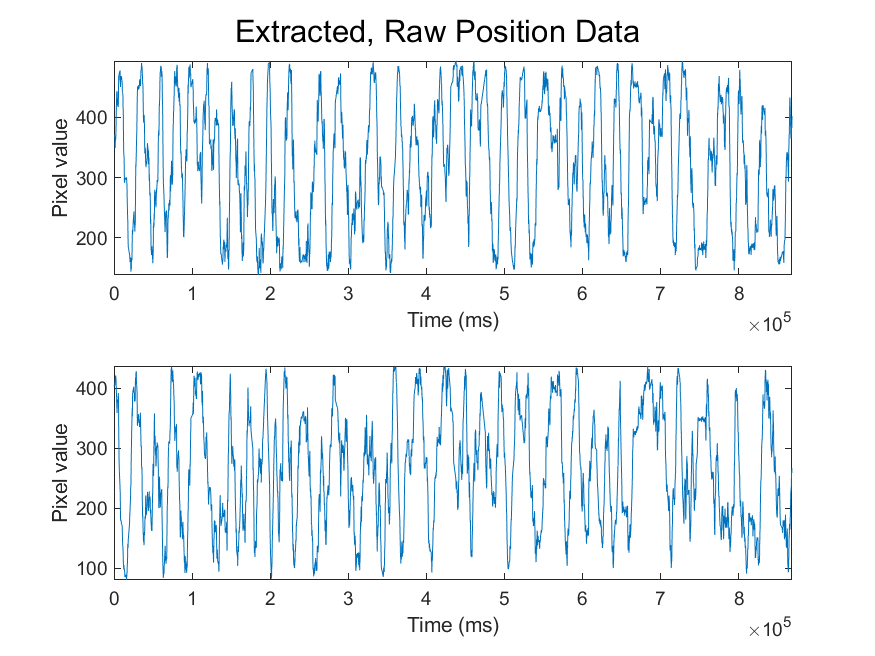
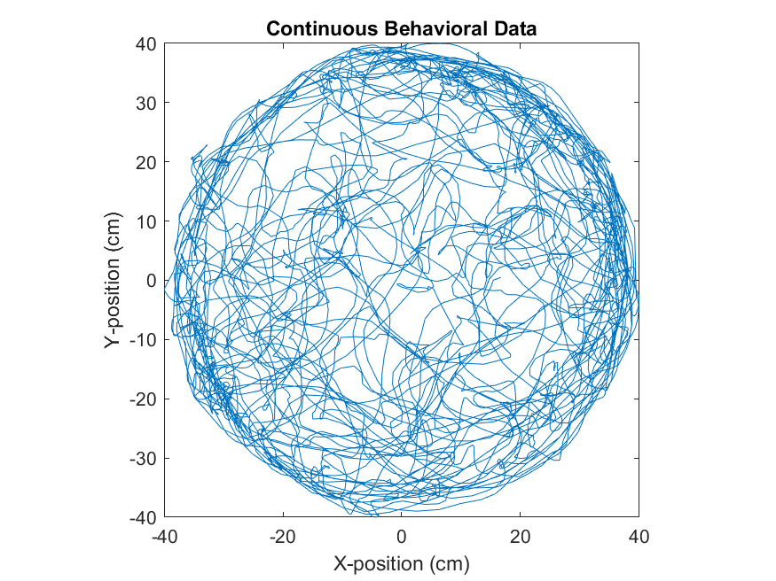
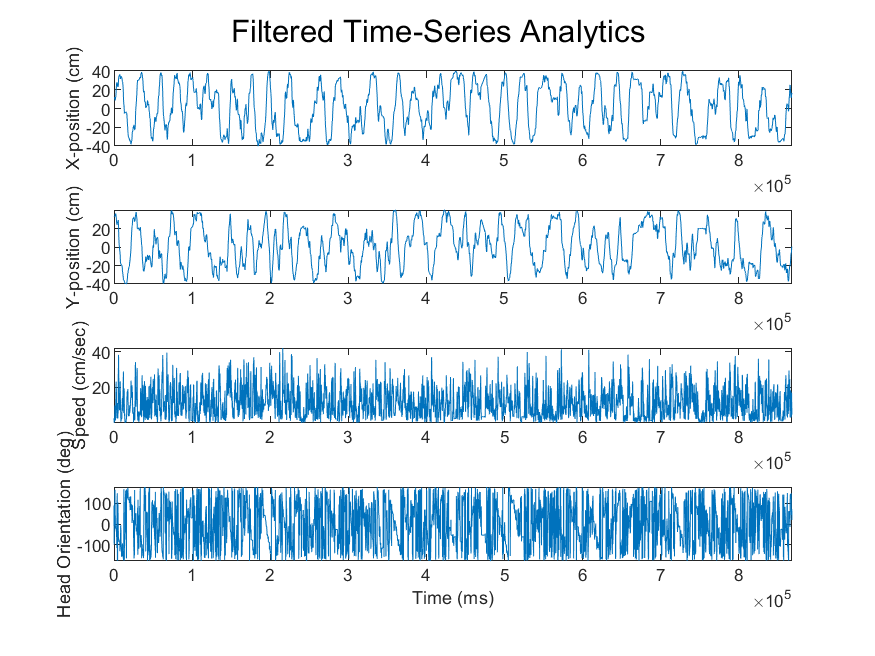
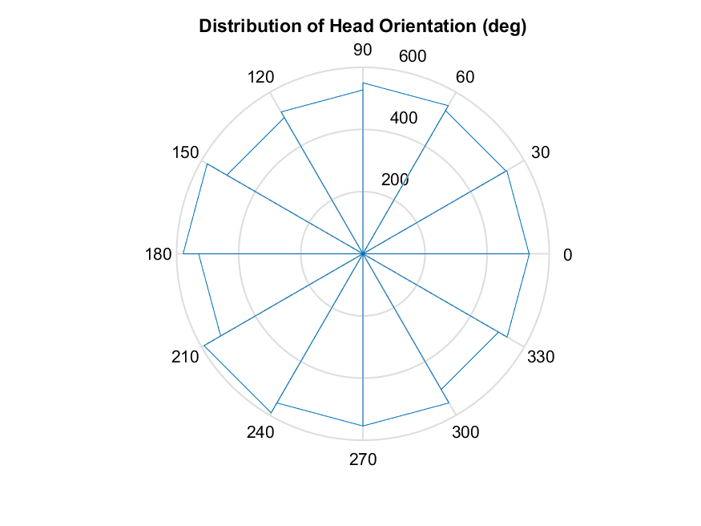
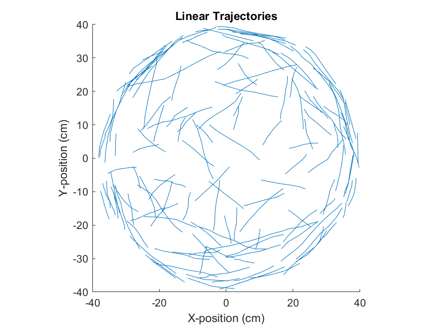
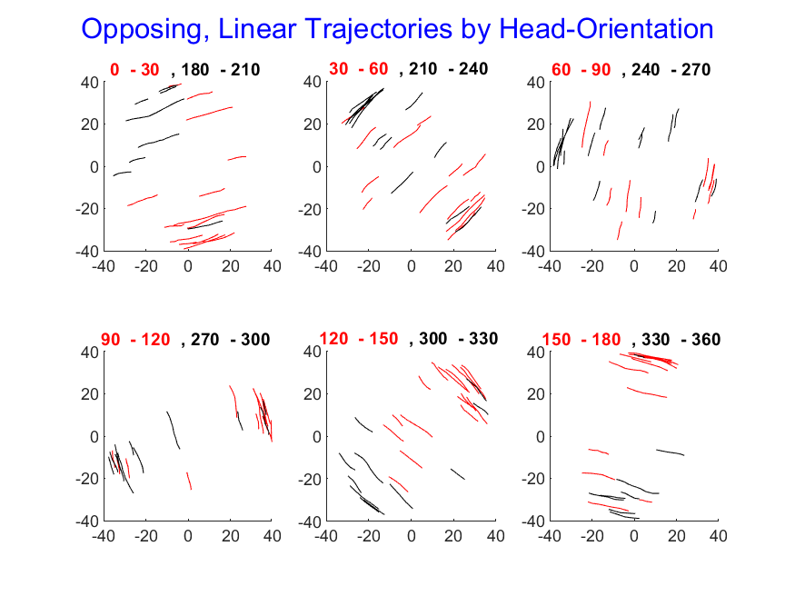
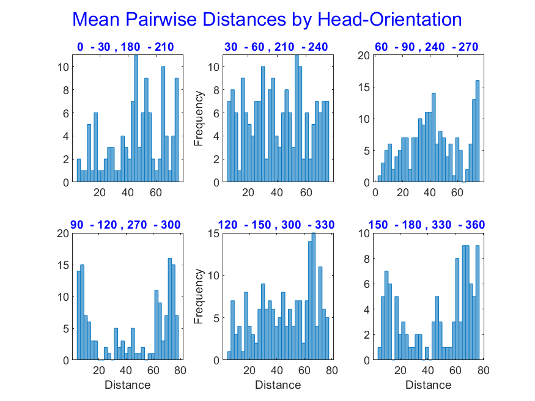
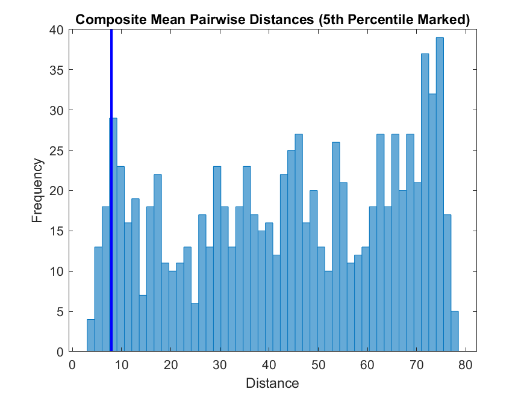
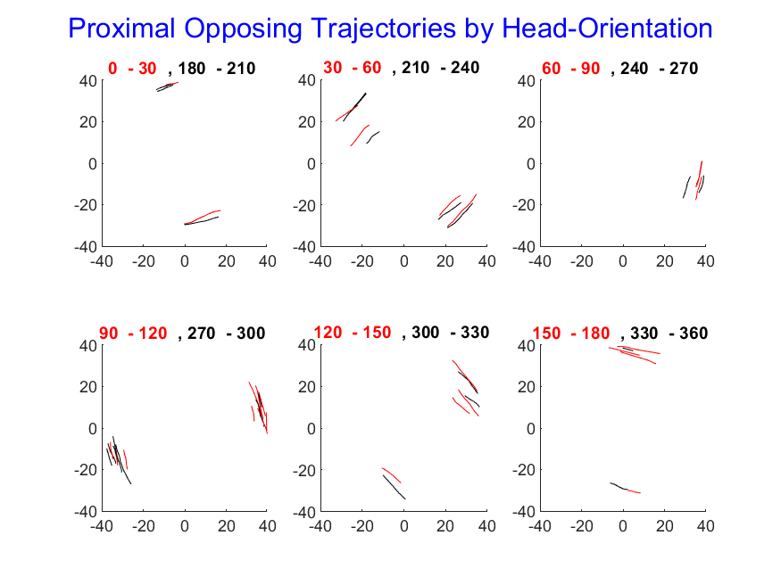

# Spatial Trajectory Analytics Dashboard

### This data was collected from videos of rats in an open-field experimental setting to support work published in [eLife, 2023](https://doi.org/10.7554/eLife.80661).

---

### 1. Frame‑Level Position Extraction
  
Pixel‑accurate XY traces gathered at millisecond resolution.

---

### 2. Drift‑Free Trajectory Reconstruction
  
Smoothing and centring remove lens distortion and arena bias. 
---

### 3. Multi‑Modal Time‑Series Context
  
Velocity, speed and heading are fused into a stitched signal.

---

### 4. Directional Intent Polar Histogram
  
Rose plots bin heading into 30° wedges. 

---

### 5. Velocity‑Gated Linear Strokes
  
Only high‑speed linear strokes survive this gate, isolating purposeful bursts from idle drift.
---

### 6. Opposing Linear Paths by Orientation
  
Bidirectional segments reveal potential conflict corridors.

---
### 7. Overlap Histogram by Direction
  
Pairwise distances between opposing paths quantify redundancy within narrow angles.
---

### 8. Global Overlap Distribution
  
The global 5th‑percentile cut‑off acts as a dynamic anomaly threshold. 

### 9. Proximal Conflict Candidates
  
The 5th‑percentile distance filter spotlights near‑misses. 
---
Author: Umais Khan (2021) 

